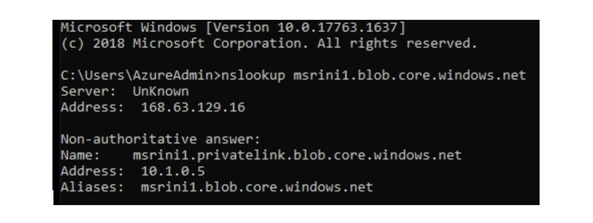
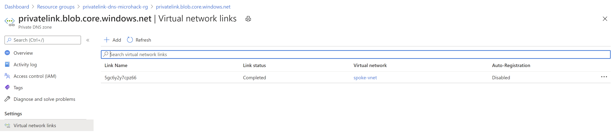
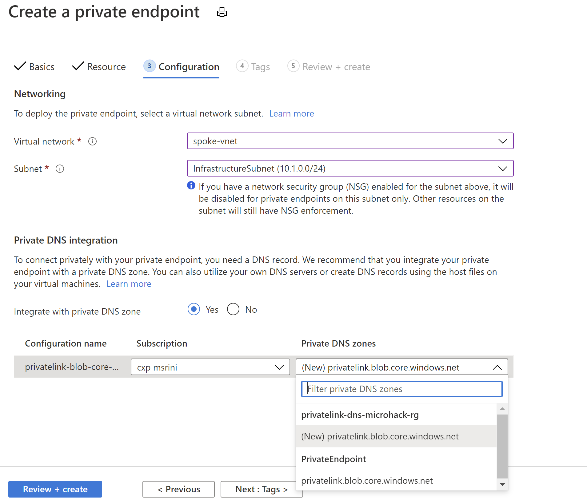
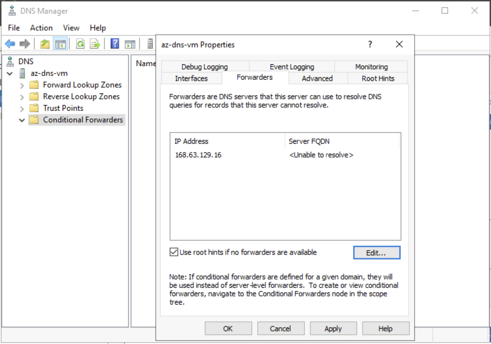
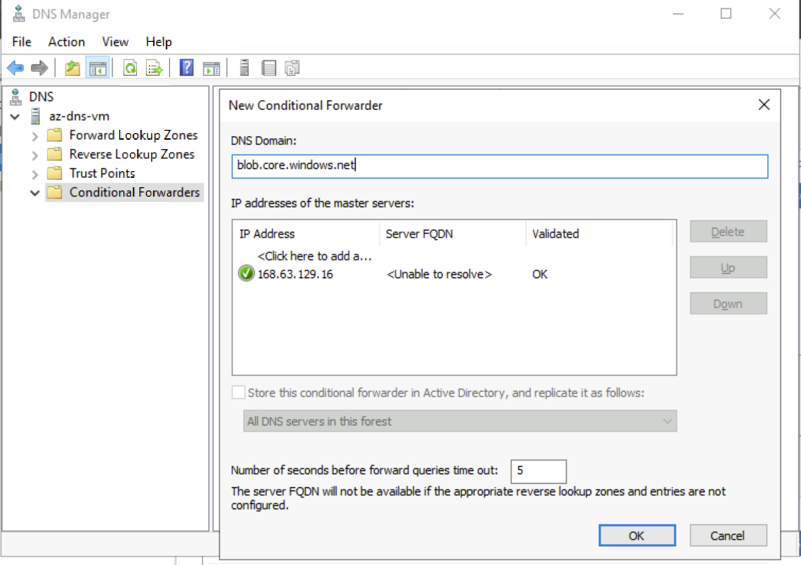
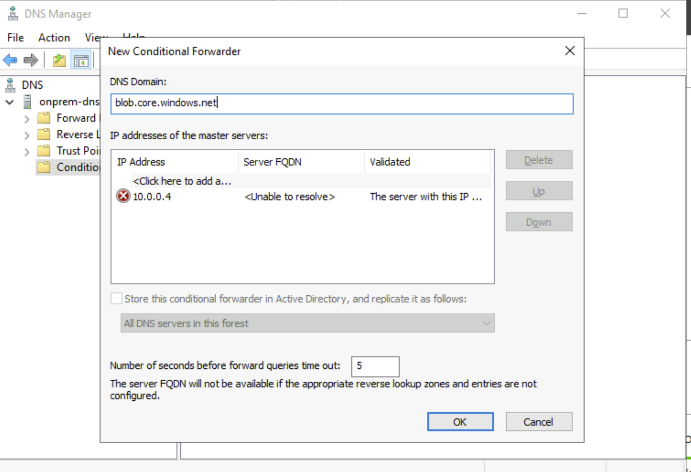

# Troubleshooting Private Link / Private Endpoint DNS Scenarios

## Introduction

This is a troubleshooting guide for Private Link DNS issue. Based on your environment, you can navigete to different scenarios and categories and follow the troubleshooting step to resolve your issue. 

- Scenario 1 - If your Source Machine is deployed in Azure. 
  - Category 1 - If you are using Azure Provided DNS in the Source Virtual Network
  - Category 2 - If you are using a Custom DNS in Source Virtual Network
    - Sub-category 1 - If your Private Endpoint and Custom DNS are part of same Virtual Network 
    - Sub-category 2 - If your Private Endpoint and Custom DNS are part of differnet Virtual Network 
 - Scenario 2 - If your Source Machine is deployed in On-Premises/ other cloud.   
  
## Does your service linked to a Private Endpoint? 
The first step is to check if your Service is configured with Private Endpoint. You can navigate to your respective resource and check if the Private Endpoint is configured and in succeeded state. Also make sure the Private Endpoint connection is approved. 
Once you verified that your Private Endpoint, Private Endpoint connection, Private Endpoint NIC are in succeeded state, now its time to check if your resource is mapped to privatelink FQDN. I have created a private endpoint for a Storage Blob, here is how the CNAME mapping would look like:

**msrini1.blob.core.windows.net.            59 IN	CNAME	msrini1.privatelink.blob.core.windows.net.**

msrini1.privatelink.blob.core.windows.net.  59 IN CNAME blob.yq1prdstr06b.store.core.windows.net.

blob.yq1prdstr06b.store.core.windows.net.   59 IN	A 52.239.190.20

If you are able to see the CNAME record "**privatelink.blob.core.windows.net**" then proceed by choosing your scenario and category below. If you are not seeing this CNAME record, make sure your 1st part resource (Storage in this case) has Private Endpoint configured and in succeeded state. If not, go ahead and raise a Support Ticket. 

You can use [this](https://www.digwebinterface.com/) tool to check whether you have CNAME record for your service FQDN. 

## Scenario 1 : Source Machine deployed in Azure

Based on the type of DNS you use, choose one of the below category:

### Category 1: If you are using Azure Provided DNS in the Source Virtual Network

- RDP or SSH into your Source Virtual Machine and perform nslookup to your service FQDN. If everything is configured correctly, then you should be able to get a Private IP of your Private Endpoint as shown below:

In case if you are getting resolved to a Public IP, then that indicates your DNS queries are sent to a Public resolver rather than Private DNS Zone which you have created for your service during the creation of your Private Endpoint. 

To check this, navigate to Private DNS Zone which has the A record pointing to the Private Endpoint and make sure that is liked to your Source VM's Virtial Network. 

If you are able to confirm that the DNS Zone is linked to your Source Virtual Network and still you are resolving to Public IP, then go ahead and raise a Support Ticket. 
> [!NOTE]

> **Known Issue and recommended solution:**

> **Issue:** You get a NX response from DNS even though you link your VNET to the Private DNS Zone of your service. 

> **Environment:**
> - Virtual Network : VNET1
> - Private DNS Zone : privatelink.blob.core.windows.net
> - Private Endpoints: PE1 - 10.0.0.4 , PE2 - 10.1.1.4
> - Virtual Machine : VM1 deployed in VNET1

> Here VNET1 is linked to Private DNS Zone named "privatelink.blob.core.windows.net" which has a A record **azstorage** pointing to 10.0.0.4. When VM1 tried to access **azstorage.blob.windows.core.net** it is resolving to 10.0.0.4. But from the same VM1, if I try to access "msrini1.blob.windows.net", there are no response. 
> This can happen, when both the Storage account is linked to Private Endpoint and have 2 differnet Private DNS Zones created. Each Private DNS Zone will be having a single A record which is pointing to a Private Endpoint and linked to respective VNETs. 

> **Solution:**
> Recommended design is to have a single Private DNS Zone for a service and link all the VNET that needs to utilize the Private Endpoint. When you deploy a new Private Endpoint you can select the existing Private DNS Zone as shown below:

### Category 2: If you are using a Custom DNS in Source Virtual Network

Based on the VNET where you deployed your PE and Custom DNS, choose any one of the sub-category:

#### Sub-category 1 - If your Private Endpoint and Custom DNS are part of same Virtual Network

The DNS query flow happens as follows:

Source VM --> Custom DNS Server (Looks for the conditional forwarder) --> Azure DNS (168.63.129.16) --> PrivateDNS Zone which is linked to the VNET -> A record -PE IP

In your custom DNS, you can configure forwarder by two ways:
- Add forwarder to 168.63.129.16 where all the DNS queries which doesn't have local entries goes to Azure DNS. 

- Add a Conditional Forwarder (blob.core.windows.net) to 168.63.129.16 where only the DNS queries of '(star).blob.windows.net' will be send to Azure DNS. Rest of the DNS queries are sent to the root hints which has the public resolver. 

What can possibly go wrong with this design:
- You might have not configured the conditional forwarder of the respective service (blob.core.windows.net) pointing to 168.63.129.16. 
- If that is configured forwarder correctly, make sure the Private DNS Zone which you have created is linked to the VNET where the DNS server is deployed. 

#### Sub-category 2 - If your Private Endpoint and Custom DNS are part of different Virtual Network

The DNS query flow happens as follows:

Source VM --> Custom DNS Server (Looks for the conditional forwarder) (DNS sevrer in differnet VNET) --> Azure DNS (168.63.129.16) --> PrivateDNS Zone which is linked to the VNET -> A record -PE IP

What can possibly go wrong with this design:
- The Source VM's VNET and the Custom DNS VNET are connected by either Vnet-peering or Site to Site or Express Route or Vnet to Vnet connection. The DNS query may fail ,if there is a disconnect between these 2 VNETs. So, it is always good to start with IP connectivity to the DNS server from the Source VM. You can use tools like [Psping](https://docs.microsoft.com/sysinternals/downloads/psping) to test the layer 4 connectivity between 2 resources in Azure. If there are IP connectivity, then follow the below steps. 
- You might have not configured the conditional forwarder of the respective service (blob.core.windows.net) pointing to 168.63.129.16. 
- If that is configured forwarder correctly, make sure the Private DNS Zone which you have created is linked to the VNET where the DNS server is deployed. 

## Scenario 2 - If your Source Machine is deployed in On-Premises/ other cloud.

- When your DNS query from On-Prem to Azure resources for the Private Endpoint fails, first make sure your have IP connectivity to Azure VNET where the custom DNS(Forwarder) is deployed. You can use tools like [Psping](https://docs.microsoft.com/sysinternals/downloads/psping) to test the layer 4 connectivity. 

- Once you made sure that the IP connectivity is not affected, On-Prem DNS configuration needs to be checked. 

  - Make sure you add the service FQDN in the conditional Forwarder not the privatelink FQDN. You need to add **blob.core.windows.net** not **privatelink.blob.core.windows.net** in the conditional forwarder. 
  - Make sure you added the Custom DNS server IP address as conditional forwarder IP. 
  
 If everything is configured fine in On-Premises end and still you are not able to resolve to Private IP of Private Endpoint, navigate to [Scenario 1, Category 2](https://github.com/msrini-MSFT/troubleshooting-Private-Link-DNS-Scenarios#category-2-if-you-are-using-a-custom-dns-in-source-virtual-network) and follow the troubleshooting steps mentioned. 

Thank you for using to guide to troubleshoot. If you find any improvements or concerns, please feel free to raise an issue below. 
